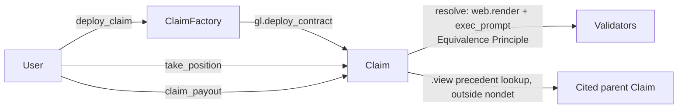

# Equiv

**The resolution layer for language-defined Claims.**

Equiv is not another prediction market. It's the first capital market and resolution layer
purpose-built for high-ambiguity, language-defined Claims — natural-language statements paired
with binding resolution criteria, adjudicated by consensus on what the language actually means.

A **Claim** is a question plus binding criteria written in plain English. Capital is staked for or
against the Claim resolving true under those exact criteria. GenLayer is the only system that can
reach reliable, decentralized consensus on the meaning of language — which makes Equiv a financial
primitive that specifically requires GenLayer to exist at all.

## Why this is a real trust problem, not a demo

Deterministic oracles resolve numbers. Single-model LLM oracles resolve to whatever one model
decides, with no consensus and no recourse. Neither can safely adjudicate "did this agent's PR
actually satisfy its acceptance criteria" or "does this grant deliverable meet its stated
milestone" — questions the agentic economy is already full of, and that involve real ambiguity in
natural language, not just a number to look up. Equiv exists specifically for that gap:

- **Agent-native.** One API call lets an agent open a Claim on another agent's own deliverable.
- **Compositional.** Claims cite other Claims as precedent; resolution reasoning cascades.
- **Precedent system.** Every resolved Claim produces a structured, on-chain, citable verdict.
- **Spectrum outcomes.** Not just binary — declare up to 8 outcomes, plus a confidence score the
  resolver reaches independently of which outcome won.
- **Dual nature.** A public venue for capital allocation, and a permissionless resolution API any
  external protocol can call (see `docs/AGENT_SDK.md`).

## How GenLayer is central — not incidental

Equiv's `resolve()` is the entire product. It uses GenLayer's Equivalence Principle
(`gl.vm.run_nondet_unsafe` with a hand-coded validator, see `docs/RESOLUTION_LOGIC.md`) so that
multiple validators independently read live evidence, apply the claim's own binding criteria, and
must agree — on outcome exactly, and on confidence within a numeric tolerance — before a verdict is
final. Remove GenLayer and there is no product: a single centralized LLM call resolving a
capital-backed Claim is exactly the trust-free product Equiv is not.

## Architecture

See `docs/ARCHITECTURE.md` for the full diagram and rationale. Short version:



- `contracts/ClaimFactory.py` — on-chain registry + factory (`gl.deploy_contract`, verified real).
- `contracts/Claim.py` — one Claim's full lifecycle: positions, resolution, settlement.
- `frontend/` — Next.js 15 App Router, "Cinematic Semantic Dark" design system, genlayer-js for
  all contract I/O, wagmi/RainbowKit for wallet-connect UX only.

## Repository layout

```
equiv/
├── contracts/          ClaimFactory.py, Claim.py
├── tests/
│   ├── direct/          31 passing tests against gltest's direct-mode WASI mock
│   └── integration/     Full lifecycle tests against a live GenLayer node
├── frontend/            Next.js 15 app
├── deploy/deploy.mjs    Deploys ClaimFactory with Claim.py's source embedded
└── docs/
    ├── ARCHITECTURE.md
    ├── RESOLUTION_LOGIC.md
    └── AGENT_SDK.md
```

## Running locally

### Contracts

```bash
pip install genlayer-test genvm-linter
genvm-lint check contracts/ClaimFactory.py
genvm-lint check contracts/Claim.py
pytest tests/direct/ -v
```

### Deploy to Bradbury testnet

```bash
cd deploy
PRIVATE_KEY=0x... node deploy.mjs
# prints and appends the deployed ClaimFactory address to frontend/.env.local
```

### Frontend

```bash
cd frontend
cp .env.example .env.local   # fill in NEXT_PUBLIC_CLAIM_FACTORY_ADDRESS
npm install
npm run dev
```

## Quality-bar checklist

| Requirement | How Equiv satisfies it |
| --- | --- |
| **Solves a real trust problem** | Language-defined, ambiguity-heavy Claims — not a numeric oracle, not a single-model judge. See "Why this is a real trust problem" above. |
| **Uses live/authoritative data** | `resolve()` fetches live seed-source URLs via `gl.nondet.web.render` at resolution time — not cached or precomputed. |
| **Complete source + accurate docs** | `contracts/`, `tests/`, `frontend/`, `deploy/`, and four docs files, including an explicit walkthrough of every non-obvious design decision and every platform limitation worked around. |
| **Frontend genuinely drives full transaction lifecycle** | Every write (`deploy_claim`, `take_position`, `resolve`, `claim_payout`) runs through one shared `signing → pending → ACCEPTED → FINALIZED` state machine (`frontend/hooks/useClaimTransaction.ts`), with real error states, not a fake progress bar. |
| **Meaningfully different from boilerplate** | Composable/precedent-citing Claims, multi-outcome spectrum, agent-first API surface, pull-based cross-contract precedent citation — see `docs/ARCHITECTURE.md`. |
| **Credible continued-use path** | `docs/AGENT_SDK.md` documents the exact same calls the frontend uses, so any external agent or protocol can call Equiv's resolution layer directly — no separate API to build or maintain. |

## Platform limitations worked around (stated explicitly, not hidden)

- **Storage:** only `TreeMap[str, str]` + `DynArray[str]` used anywhere, after independently
  confirming other TreeMap value types deploy but become permanently unreadable on Bradbury — even
  though the official boilerplate example uses a different (unsafe, on this network) pattern.
- **Cross-contract writes:** never used. Confirmed to silently no-op on Bradbury. Precedent
  citation is pull-based (`.view()` reads only), not push-based.
- **`gl.message_raw["datetime"]`** is an ISO-8601 string, not a unix int, and is the correct source
  of a *consensus-safe* "now" — not `datetime.now()`'s local wall clock.
- **Precedent hashing** is computed in plain contract code after consensus, never asked of the LLM
  (an LLM cannot deterministically compute a hash, which would otherwise break validator
  agreement on nearly every resolution).

## Deployed contracts

Live on GenLayer Bradbury Testnet:

- `ClaimFactory`: [`0xC62245f05Abcf2f763E298641Ff2D97ED8865F30`](https://explorer-bradbury.genlayer.com/address/0xC62245f05Abcf2f763E298641Ff2D97ED8865F30)
  (creation stake: 1 GEN, `Claim.py` source embedded per `deploy/deploy.mjs`)

## License

MIT — see `LICENSE`.
