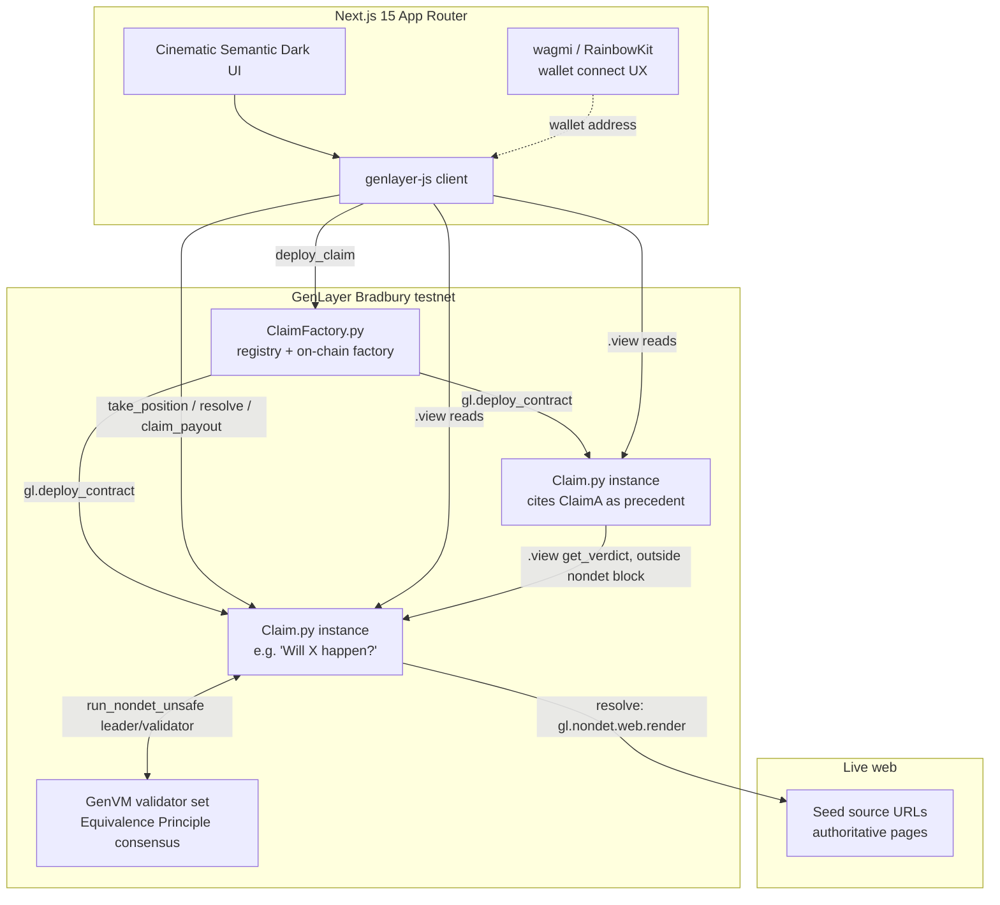

# Architecture

## System overview

## Contract architecture

Two contracts, matching the verified `genlayerlabs/intelligent-oracle` reference pattern (same
`py-genlayer` dependency hash independently confirmed live on Bradbury across multiple prior
projects):

- **`ClaimFactory.py`** — a registry that deploys a fresh `Claim` contract per Claim via
  `gl.deploy_contract(code=claim_source.encode("utf-8"), args=[...], salt_nonce=...)`. Claim
  source is passed in as a constructor argument (`claim_code: str`) at ClaimFactory's own deploy
  time, exactly as `genlayerlabs/intelligent-oracle`'s `Registry` contract does. Factory metadata
  (question, criteria, outcomes, creator, tags, seed sources, parent claims) is stored once at
  creation and is **read-only** afterward — the factory has no way to be pushed live status
  updates from a Claim (see "Why no cross-contract writes" below), so it never claims to know a
  Claim's current status. Callers read status from the Claim contract directly.
- **`Claim.py`** — a single Claim's full lifecycle: `take_position` (payable, parimutuel staking
  per declared outcome), `resolve` (the Equivalence Principle consensus step), `claim_payout`
  (post-resolution settlement), and view methods (`get_claim`, `get_verdict`, `get_pools`,
  `get_position`, `get_status`).

## Storage design

Every persistent field uses only `TreeMap[str, str]` (JSON-encoded values) and `DynArray[str]` —
deliberately, not a style preference. Live testing on a prior project (see memory:
`genlayer-allow-storage-broken`) found that `TreeMap` value types other than `str` — including
`@allow_storage @dataclass` values and plain scalars like `TreeMap[str, u256]` — deploy
successfully (ACCEPTED consensus, looks completely healthy) but become **permanently unreadable**
on the current Bradbury GenVM build. This is a real, reproduced, dated finding, not speculation.

The official `genlayer-project-boilerplate` example (`football_bets.py`) uses
`TreeMap[Address, TreeMap[str, dataclass]]` — Equiv deliberately does not copy that pattern. An
"official example" is not the same claim as "verified working on this specific network," and
where the two conflict, the verified-safe pattern wins. This is stated plainly here rather than
silently deviating, exactly so a reviewer doesn't have to guess why the storage shapes differ from
the boilerplate.

## Why no cross-contract writes

Cross-contract **write** calls (`gl.get_contract_at(addr).emit(...).some_method(...)`) reach
ACCEPTED consensus on the calling contract's own transaction but the target contract's state
never actually changes — confirmed twice independently on Bradbury in a prior project. Cross-
contract **reads** via `.view()` work correctly and are used here for precedent citation: when
`Claim.resolve()` needs a cited parent's verdict, it calls
`gl.get_contract_at(Address(parent)).view().get_verdict()` — and does so **outside** the
`run_nondet_unsafe` closure, since cross-contract calls are forbidden inside a nondet block
(`SystemError: 6`, confirmed via `gltest`'s own mock enforcement, mirroring real GenVM behavior).

This means Equiv's composition model is pull-based, not push-based: a Claim never notifies its
children when it resolves. A citing Claim reads its parent's state itself, at its own resolve()
time. ClaimFactory's `get_children(address)` view method (a linear scan over its own registry) lets
the frontend discover a Claim's citing children for display, without relying on any contract-to-
contract notification that doesn't reliably work on this network.

## Resolution consensus

`Claim.resolve()` uses `gl.vm.run_nondet_unsafe(leader_fn, validator_fn)` with a **hand-coded**
Python validator — not `gl.eq_principle.prompt_comparative`'s natural-language `principle` string.
Both APIs are real and documented; this project chose the code-enforced comparison deliberately:
`validator_fn` checks `outcome` for exact match and `confidence` for numeric agreement within a
0.15 tolerance, computed in real Python arithmetic, not judged by another LLM call interpreting an
instruction like "confidence values must be close." For a capital-backed adjudication layer, an
auditable, exact tolerance check is a stronger guarantee than trusting a second model's
interpretation of "close enough."

`precedent_hash` is computed with `hashlib.sha256` in plain contract code, **after** consensus is
reached, from the fields validators actually agreed on (`claim_id`, `outcome`, `confidence`,
`criteria`) — not asked of the LLM. Independent leader/validator LLM calls cannot deterministically
agree on a self-reported "hash" string (LLMs don't execute hash functions), so asking for one in
the prompt would produce spurious validator disagreement on nearly every resolution. See
`RESOLUTION_LOGIC.md` for the full walkthrough.

## Frontend

Next.js 15 (App Router) + TypeScript strict. RainbowKit/wagmi own wallet-connect UX only (address
display, network chrome); all actual contract reads/writes go through `genlayer-js`, bound to the
connected wallet's injected provider (`lib/genlayer.ts`). Every write flow (`deploy_claim`,
`take_position`, `resolve`, `claim_payout`) drives its UI off one shared state machine
(`hooks/useClaimTransaction.ts`): `signing → pending → ACCEPTED → FINALIZED`, with real error
states — never a fake progress bar disconnected from the actual transaction.

## Known scaling limitations (stated, not hidden)

- **No global "positions by holder" or "resolved claims" index.** `useMyPositions` and
  `usePrecedents` walk every deployed Claim via `ClaimFactory.get_claims()` and read each one.
  Fine at testnet scale; a real index (subgraph-style, or an on-chain registry field updated at
  `resolve()` time) is the natural next step at production scale.
- **`ClaimFactory.get_claims_by_tag`/`get_children`** are O(n) linear scans over the registry for
  the same reason — acceptable for a testnet-scale demo, called out explicitly rather than implied
  to be indexed.
